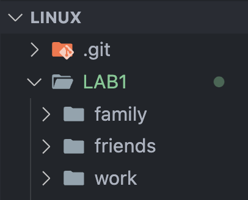

# File Creation and Organization Using Linux Commands  

## 1. Creating Multiple Empty Files  
Use the `touch` command to generate a set of empty files for practice.  

## 2. Using Brace Expansion for Efficiency  
Leverage brace expansion to replace `X` with numbers ranging from **1 to 6** when creating multiple files simultaneously.  

## 3. File and Directory Management  
- Create six files with the following naming patterns:  
  - `songX.mp3`  
  - `snapX.jpg`  
  - `filmX.avi`  
- Organize these files into three directories:  
  - `friends`  
  - `family`  
  - `work`  
- Use a **single command** to create all three directories at once.  

## 4. Command Execution  
To achieve the above tasks efficiently, run the following commands in the terminal:  

```bash
# Creating multiple files using brace expansion
touch song{1..6}.mp3 snap{1..6}.jpg film{1..6}.avi

# Creating multiple directories in a single command
mkdir friends family work
```


