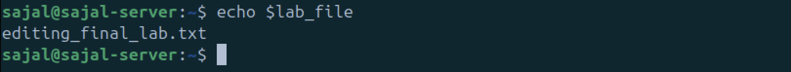

# Lab Experiment 03: Editing Files Using Nano  

In this lab, we will:  
- Create a file using the `touch` command.  
- Edit the file using **Nano**, a simple and user-friendly text editor.  
- Use a **shell variable** to reference the filename dynamically.  

---

## **1. Creating a File Using the `touch` Command**  
The `touch` command is used to **create an empty file** in Linux.  

### **Command to Create the File:**  
```bash
touch editing_final_lab.txt
```


**Vim:**
```bash
vim editing_final_lab.txt
```
- Use :q to quit the vim and save the changes


**Nano:**
```bash
nano editing_final_lab.txt
```
- use ctrl+x -> Y -> Enter to save changhes and quit the nano editor


**Shell Variable:**
```bash
lab_file="editing_final_lab.txt"
```
- declaring the variable
- use echo and $ sign to call the variable

