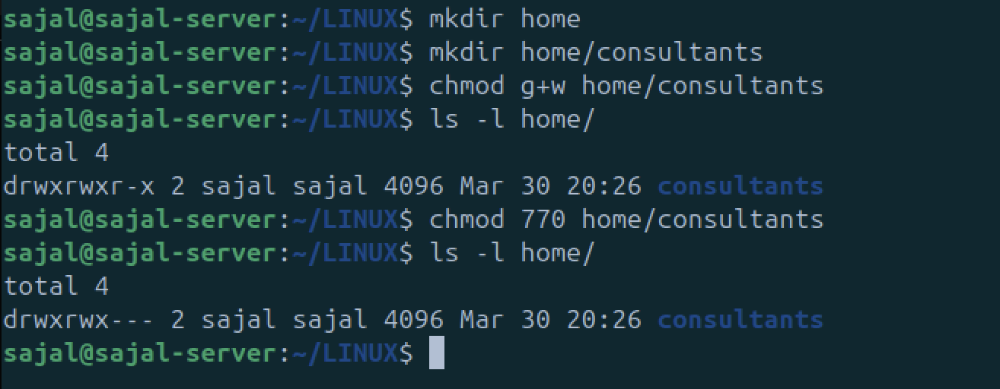
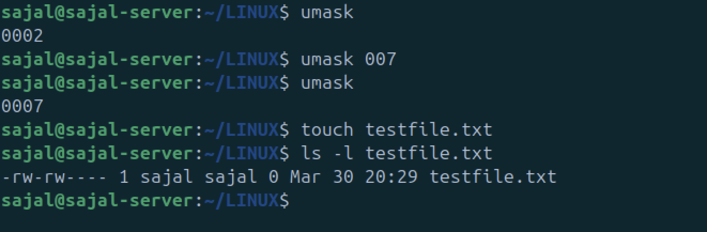

# Lab Experiment 04: Permission Management in Linux  

In this lab, we will:  
- **Create a directory** for consultants.  
- **Manage permissions** using both symbolic and octal methods.  
- **Change the default `umask` value** for a user to restrict access.  

---

## **1. Creating the `/home/consultants` Directory**  

The first step is to create the directory where files will be stored for consultants.  

### **Command to Create the Directory:**  

```sh
mkdir home
mkdir home/consultants

ls -ld /home/consultants

chmod g+w home/consultants
ls -l

chmod 770 home/consultants
ls -l
```

- mkdir → Creates a new directory.

- -l → Lists directory details.
- -d → Shows directory properties instead of contents.

- chmod → Modifies file permissions.
- g+w → Grants write (w) permission to the group (g).

- 770 → Owner (7), Group (7), Others (0).
    - 7 = Read (r), Write (w), Execute (x).
    - 0 = No permissions for others.



## Changing the Default `umask` for operator1 User

Change the default umask for the operator1 user. The new umask prohibits all access for users that are not in their
group. Confirm that the umask is changed.

```bash
umask

umask 007

# verify the umask by running these 
touch testfile.txt
ls -l testfile.txt
```

