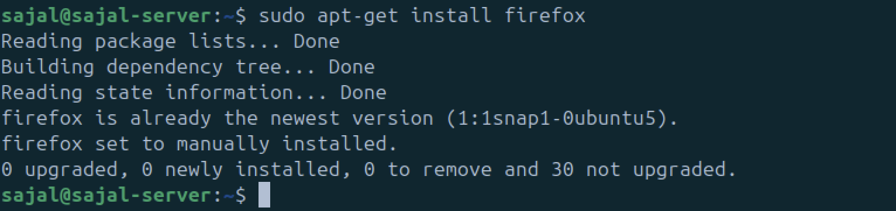

# Lab Experiment 05: Process and Package Management in Linux  

## **Objective**  
In this lab, we will:   

Learn and implement **process management** using `ps`, `top`, and `kill` commands.  

Perform **package management** using `apt-get` for installing, updating, and removing software.  

---

## **1. Process Management in Linux**  

Processes are instances of running programs. Linux provides tools to **monitor and manage processes** efficiently.  

### **1.1 Listing Processes with `ps`**  
The `ps` command displays information about active processes.  

#### **Basic Usage:**  
```sh
ps # Process 
ps -e # Displaying All Processes (-e option)
ps -e -f # Detailed Process View (-e -f option)
ps -p 4057 # Viewing a Specific Process (-p option)
top # Monitoring Processes in Real-Time (top Command)
```


## **2.  Package Management in Linux (Using apt-get)**  

```sh
sudo apt-get update
sudo apt-get install firefox
sudo apt-get remove firefox
sudo apt-get install firefox
sudo apt-get purge firefox
```




